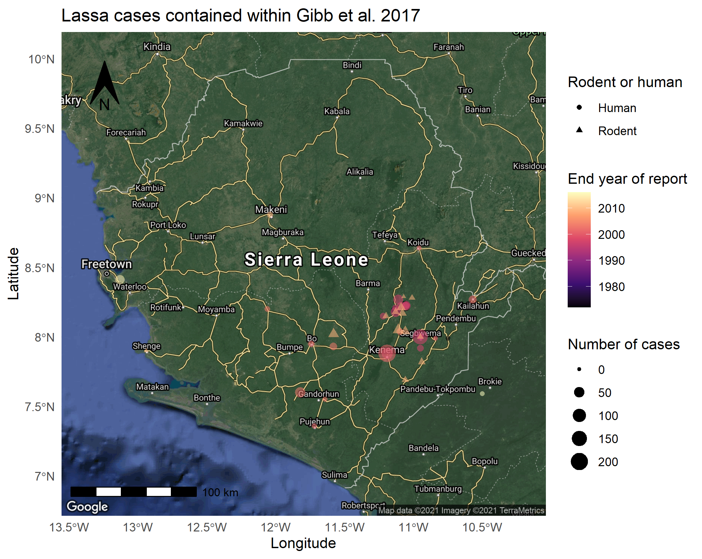
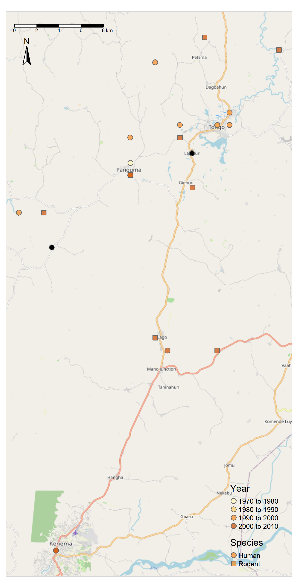
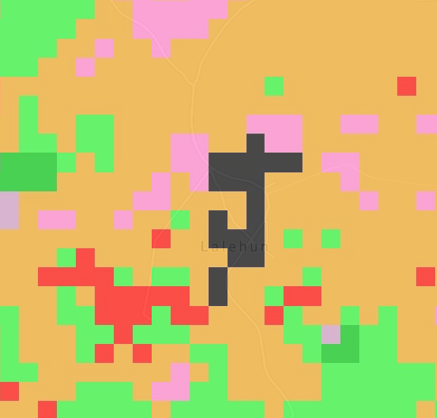
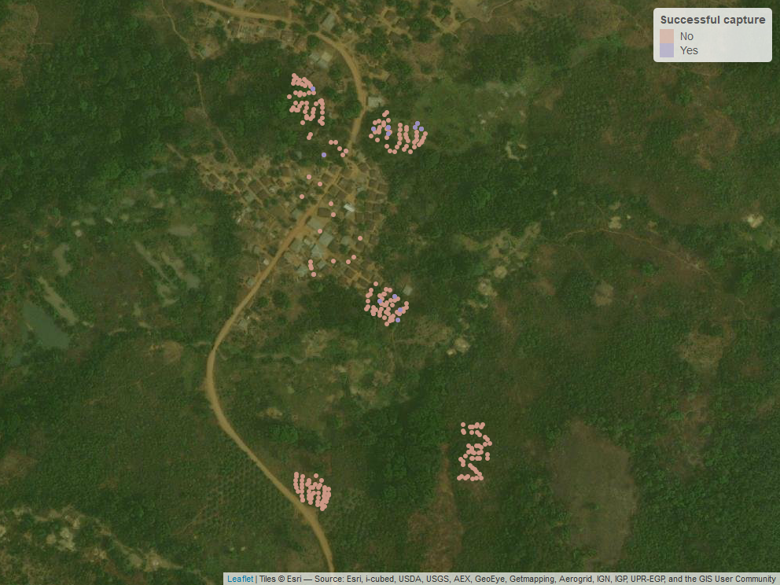
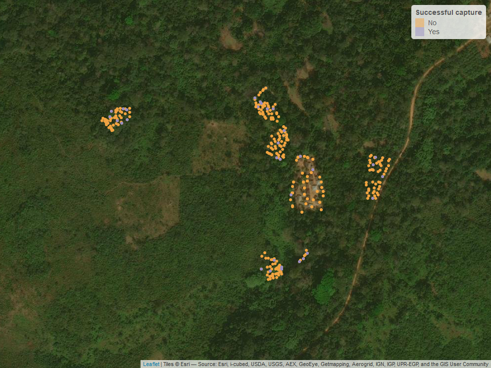

```{r setup, include=FALSE, quietly=TRUE}
knitr::opts_chunk$set(echo = TRUE, warning = F, message = F)
source(here::here("scripts", "project_library.R"))
source(here("scripts", "download_data.R"))
```
This report is generated within an RMarkdown document. It uses data within my `rodent_trapping` repository on GitHub (available [here](https://github.com/DidDrog11/rodent_trapping), it is currently private but if you want access let me know) and data extracted from other publically available resources.

## Thesis hypothesis
Increasing intensity of anthropogenic land use along a socio-ecological gradient affects rodent species richness and abundance within a Lassa fever endemic region of Sierra Leone, altering within rodent and rodent-to-human transmission dynamics of Lassa fever virus.

### Thesis questions
  * Is degree of anthropogenic habitat disturbance associated with a change in rodent assemblages favouring generalist species?
  * Does the structure of rodent species assemblages within a habitat alter Lassa fever virus incidence and prevalence in Mastomys natalensis?
  * Does habitat degradation and subsequent change in rodent species assemblages increase the risk of Lassa fever virus spillover events into local human populations?

## Pilot study report
An initial report for the trapping activity conducted November-December 2020

### Study site selection
A recent review conducted by Rory Gibb et al. 2017 collated published and unpublished documented Lassa Fever cases (humans) and infections (PCR) or seroprevalence (Ab) (rodents) from countries reporting LASV presence. This data has been used to support study site selection.

```{r site_selection, include=F, quietly=T}
file.copy(from = file.path(substr(here(), 1, nchar(here())-16), "miscellaneous", "cryptic_lassa", "figures", "lassa_SL.png"), to = here("reports", "figures"), overwrite = T) #copy image of lassa cases from miscellaneous repository to current report folder. 
file.copy(from = file.path(substr(here(), 1, nchar(here())-16), "miscellaneous", "cryptic_lassa", "figures", "lassa_panguma.png"), to = here("reports", "figures"), overwrite = T)
```

This highlights that most of the documented cases of Lassa Fever in Sierra Leone are found in the East of the country. There is a particularly large cluster around Kenema, the location of the Lassa Fever treatment ward and reference laboratory. There is a slightly smaller cluster to the North and North East of the city around Panguma and Segbwema. recently cases have been detected near Freetown and Bo suggesting a wider distribution. Several projects over the last couple of years, PREDICTS and LAROCS have been conducting larger transect studies across the country which while not formally reported are suggestive of widespread serological evidence of infection in rodents.

My work will be focussed primarily around Panguma, I will set up a "control" site in Kambia and I would also like to set up an additional semi-urban site on the outskirts of either Panguma or Kenema to complement the two rural sites I will describe below.


The above map highlights human cases and positive rodents in and around Panguma. This in combination with land use maps was used to select the two rural sites. Lalehun lies to the East of Panguma. Seilama lies to the South West. Both are represented by a black diamond.

### Land use at the study sites

To address the above questions it's important to sample rodents in several distinct habitats. If these habitats undergo changed use during the observed study period this would provide additional causal evidence for any changes in rodent assemblage species composition. However, this is not a specific requirement for this work. Observed differences between species composition across different land usages remains illustrative.

This land use classification is obtained from a recent paper by [Jung et al. 2020](https://www.nature.com/articles/s41597-020-00599-8). The colours represent different IUCN habitat classifications

  * Black = 14.5 Urban Areas
  * Orange = 3.6 Shrubland - Subtropical-tropical moist
  * Red = 14.3 Plantations 
  * Light green = 1.6 Forest - subtropical-tropical moist lowland
  * Dark green = 1.9 Forest - subtropical-tropical moist montane
  * Mauve = 3.7 Shrubland - subtropical-tropical high altitude




Using the habitat map and discussions with locals we identified sites that would provide use with varied habitats and that would also be able to be repeatedly sampled irrespective of whether the visit was conducted during the rainy season.

### Lalehun (Village 1) trap grid locations


The base map used here is from Google maps and so is unfortunately not entirely up-to-date. 
``` {r trap_data, include = F}
source(here("scripts", "rodent_data_management.R"))
```

```{r trap_site_classifications_lalehun, include=F}
trap_sites %>%
  filter(village == "lalehun") %>%
  dplyr::select(grid_number, habitat) %>%
  distinct()
```

The habitats of the trap grids are as follows:

 * 1 - Village periphery
 * 2 - Proximal agriculture (wet rice field)
 * 3a - Developing Banana plantation and fallow land
 * 3b - Developing Banana plantation and Pineapple garden
 * 4 - Disturbed forest, long-term (5 years) fallow land
 * 5 - Cassava plantation
 * 6 - Within the village, outside of houses
 
The specific location of each individual trap was also recorded (e.g. edge environment, base of tree)

### Seilama (Village 1) trap grid locations


```{r trap_site_classifications_seilama, include=F}
trap_sites %>%
  filter(village == "seilama") %>%
  dplyr::select(grid_number, habitat) %>%
  distinct()
```
The habitats of the trap grids are as follows:

 * 1 - Palm plantation, near the village and main road
 * 2 - Proximal agriculture (Cacao and Coffee plantation)
 * 3 - Recently harvested dry rice field
 * 4 - Cassava plantation
 * 5 - Disturbed forest, long term fallow
 * 6 - Within the village, outside of houses

This effectively produces 1 trap site in the village, 3 proximal agricultural sites, 1 distal agriculture and 1 forest/fallow land site for each village site.

The code to produce the maps of trap location is in `scripts/geolocation_traps.R` with the data available in `data/trap_sites.csv`

## Initial data

### Trap data

Lalehun was visited first, it took a couple of days to get up and running properly there so less trap nights were completed. 726 from Lalehun compared to 1120 from Seilama.

```{r trap_nights, echo=F}
ggplot(trap_sites) +
  geom_bar(aes(x = village, fill = habitat), position = "fill") +
  scale_y_continuous(labels = scales::percent) +
  theme_minimal() +
  scale_x_discrete(labels = c("Lalehun N = 726", "Seilama N = 1120")) +
  scale_fill_discrete() +
  labs(title = "Proportion of trap-nights obtained from each habitat",
       fill = "Habitat",
       x = "Village",
       y = "Percentage")
```

During this visit no traps were set in houses, this will change for future visits.

``` {r trapping_efficiency, echo=F}
trap_sites %>%
  group_by(date_set, village) %>%
  summarise(n = n()) %>%
  ggplot() +
  geom_col(aes(x = date_set, y = n, fill = village)) +
  theme_minimal() +
  scale_fill_discrete(labels = c("Lalehun N = 726", "Seilama N = 1120")) +
  labs(title = "Number of traps set each night",
       fill = "Village",
       x = "Date",
       y = "Number of traps set")
```

We arrived late in Lalehun on the first day and were only able to set up one site, two further sites were set the next day with the final two up by the 2nd of December. We were more efficient by the time we got to Seilama with all but the village site set up on the first day. We were thus able to complete 4 nights of trapping at each site in Seilama.

### Catch data

We recorded the presence or absence of rodent bait the next morning, along with whether the trap was found to be sprung closed (i.e. it had been disturbed overnight or it had been triggered by a rodent but it had not successfully trapped it).

``` {r bait_removed, echo=F}
trap_sites %>%
  mutate(bait_present = recode(bait_present, "y, partially" = "y")) %>%
  filter(bait_present != "na") %>%
  group_by(trap_night, village, habitat, bait_present) %>%
  summarise(n = n()) %>%
  ggplot() +
  geom_col(aes(x = trap_night, y = n, fill = bait_present), position = "fill") +
  scale_y_continuous(labels = scales::percent) +
  facet_wrap(habitat ~ .) +
  theme_minimal() +
  scale_fill_discrete(labels = c("Bait absent", "Bait present")) +
  labs(title = "Proportion of traps with bait absent",
       fill = "Bait",
       x = "Trap night",
       y = "Percentage")
```

There appears to be a decrease in removal of bait from the traps in subsequent nights
``` {r trap_success, echo=F}
trap_sites %>%
  filter(rodent_trapped != "na") %>%
  group_by(trap_night, village, habitat, rodent_trapped) %>%
  summarise(n = n()) %>%
  mutate(proportion = n/sum(n)) %>%
  ggplot() +
  geom_col(aes(x = trap_night, y = proportion, fill = village, alpha = rodent_trapped), position = "dodge") +
  facet_wrap(habitat ~ ., labeller = labeller(habitat = habitat_names), scales = "free") +
  theme_minimal() +
  scale_fill_discrete(labels = c("Lalehun", "Seilama")) +
  scale_alpha_discrete(labels = c("Trap empty", "Rodent trapped")) +
  labs(title = "Proportion of traps with rodents",
       fill = "Village",
       alpha = "Trap status",
       x = "Trap night",
       y = "Proportion")
```

65 Rodents were trapped during the pilot study:

  * 22 in Lalehun for an overall trap success rate of 3% 
  * 43 from Seilama for a trap success rate of 3.8%

No rodents were trapped in the distal agriculture or forested habitats at Lalehun, although it must be noted that only two nights of traps were set in those locations. 

#### Location of trapped rodents

48 (74%) of the trapped species belong to the family Muridae, the remaining 17 (26%) were shrews (family Soricidae). 
``` {r rodent_trap_plots, echo=F}
murid <- OpenImageR::readImage(here("reports", "figures", "murid_png.png"))

trapped_rodents %>%
  mutate(village = substr(rodent_id, 1, 3),
         village = as_factor(recode(village,
                                    "SEI" = "Seilama",
                                    "LAL" = "Lalehun"))) %>%
  group_by(genus, village) %>%
  summarise(n = n()) %>%
  mutate(total = sum(n)) %>%
  mutate(genus = as_factor(snakecase::to_sentence_case(as.character(genus)))) %>%
  ggplot() +
  geom_col(aes(x = reorder(genus, total), y = n, fill = village)) +
  coord_flip() +
  theme_minimal() +
  labs(title = "Number of individuals of different genera caught in each village",
       y = "Number",
       x = "Genus",
       fill = "Village",
       caption = "") +
  annotation_custom(rasterGrob(murid), ymin = 12.5, ymax = 17.5, xmin = 0, xmax = 5)
```

The shrews (genera *Crocidura*) form the highest proportion of individuals. *Praomys* and *Lophuromys* were the most abundant Muridae genera. *Praomys* was not detected in Lalehun with *Lophuromys* being detected at both study sites. *Mus* and *Lemniscomys* were the only other Muridae caught in Lalehun. 6 additional genera of Muridae were trapped in Seilama above those caught in Lalehun.
``` {r rodent_trap_plot_2, echo=F}
trapped_rodents %>%
  filter(family == "muridae") %>%
  select(rodent_id, field_id, genus) %>%
  left_join(., trap_sites %>%
              select(rodent_id, habitat, village),
            by = "rodent_id") %>%
  mutate(genus = as_factor(snakecase::to_sentence_case(as.character(genus))),
         village = recode_factor(village,
                                 "lalehun" = "Lalehun",
                                 "seilama" = "Seilama")) %>%
  ggplot() +
  geom_bar(aes(x = habitat, fill = village)) +
  coord_flip() +
  facet_wrap(genus ~ .) +
  theme_minimal() +
  labs(title = "Habitats of trapped rodents",
       x = "Habitat",
       y = "Number of individuals",
       fill = "Village")
```

This shouldn't be over interpreted at the moment as more data will be needed but there is expected to be a difference in the habitat preferences of different species. This can also be looked at over time/seasonality.
``` {r location_shrews, echo=F}
shrew <- OpenImageR::readImage(here("reports", "figures", "shrew_png.png"))

trapped_rodents %>%
  filter(family == "soricidae") %>%
  select(rodent_id, field_id, genus) %>%
  left_join(., trap_sites %>%
              select(rodent_id, habitat, village),
            by = "rodent_id") %>%
  mutate(genus = as_factor(snakecase::to_sentence_case(as.character(genus))),
         village = recode_factor(village,
                                 "lalehun" = "Lalehun",
                                 "seilama" = "Seilama")) %>%
  ggplot() +
  geom_bar(aes(x = habitat, fill = village)) +
  coord_flip() +
  scale_x_discrete(drop = F) +
  facet_wrap(genus ~ .) +
  theme_minimal() +
  labs(title = "Habitats of trapped shrews",
       x = "Habitat",
       y = "Number of individuals",
       fill = "Village") +
  annotation_custom(rasterGrob(shrew), ymin = 5, ymax = 7, xmin = 0, xmax = 2)
```

Shrews were trapped in most locations but not within the forested/fallow areas.

### Diversity

``` {r genera_richness, echo=F}
site_labels <- c("Lalehun_1" = "Site 1", "Lalehun_2" = "Site 2", "Lalehun_3" = "Site 3", "Lalehun_6" = "Site 6", "Seilama_1" = "Site 1", "Seilama_2" = "Site 2", "Seilama_3" = "Site 3", "Seilama_4" = "Site 4", "Seilama_5" = "Site 5", "Seilama_6" = "Site 6")

trapped_rodents %>%
  mutate(village = substr(rodent_id, 1, 3),
         village = recode_factor(village, 
                                 "LAL" = "Lalehun",
                                 "SEI" = "Seilama"),
         site_id = substr(site_id, 1, 1),
         site = paste(village, site_id, sep = "_")) %>%
  group_by(site, genus) %>%
  summarise(n = n()) %>%
  summarise(richness = n()) %>%
  mutate(village = factor(substr(site, 1, 7))) %>%
  ggplot() +
  geom_col(aes(x = site, y = richness)) +
  scale_x_discrete(labels = site_labels) +
  facet_grid(. ~ village, scales = "free_x") +
  theme_minimal() +
  labs(title = "Genus richness at trap sites",
       y = "Genus richness",
       x = "Trap site")
```

Richness was similar across all sites in Seilama, less so in Lalehun but likely related to the reduced trap nights obtained there.
``` {r individual_abundance, echo=F}
trapped_rodents %>%
  left_join(., trap_sites %>%
              select(rodent_id, habitat, village),
            by = "rodent_id") %>%
  mutate(village = substr(rodent_id, 1, 3),
         village = recode_factor(village, 
                                 "LAL" = "Lalehun",
                                 "SEI" = "Seilama"),
         site_id = substr(site_id, 1, 1),
         site = paste(village, site_id, sep = "_")) %>%
  group_by(site, habitat) %>%
  summarise(abundance = n()) %>%
  mutate(village = factor(substr(site, 1, 7))) %>%
  ggplot() +
  geom_col(aes(x = site, y = abundance, fill = habitat)) +
  scale_x_discrete(labels = site_labels) +
  scale_y_continuous(breaks = scales::pretty_breaks()) +
  facet_grid(. ~ village, scales = "free_x") +
  theme_minimal() +
  labs(title = "Individual abundance at trap sites",
       y = "Individual abundance",
       x = "Trap site")
```

There was some degree of increased abundance in the agricultural and fallow sites in Seilama compared to the village site. No rodents were trapped in site 4 and 5 in Lalehun so makes any comparisons slightly harder.

We will go on to calculate species diversity with for example the Shannon-Wiener index but I'd like to do some further work speciating the trapped rodents before this.

### Species ID
I generated a taxanomic key for the small mammals likely to be trapped in the sites based on occurence data from two sources. The first by [Ara Monadjem et al.](https://www.degruyter.com/view/title/126014) which had data on rodents and the second by [Kingdon and Happold](https://www.bloomsbury.com/uk/mammals-of-africa-9781408122570/). These resources provided data that has been extracted into `rodent_ids.R`. The local team also had expertise in identifying rodents to species which was invaluable.

The `field_id` is based on their initial classification. I have then compared the measurements obtained in the field with the published measurements to corroborate their classification or suggest potential misclassification. All rodents were photographed and tissue samples were taken for chromosomal ID if required.

The below table captures the mean and range of the recorded morphometry we have collected in the field. Some species are missing catalogue data.
``` {r, rodent_id, echo=F}
DT::datatable(rodent_ids)
```

This data is matched to the measurements in the literature in `scripts/matching_species.R`. It is split into Rodents and Shrews as they can be distinguished at that level. In future versions I will do similar for the genera of the rodents for those that are able to be taxanomically distinguished based on external appearance.

This generates two dataframes where for each individual I rank the similarity to the literature measurements. I allow them to match to the mean +/- 10%, there is no allowance for being above or below the min/max. A weighted score is then generated from the proportion of means that were matched between the individual and reference species across the morphometric measurements (termed the `mean_match`). The same is done for ranges (termed the `range_match`). A weighted score is then produced where the range match is worth half of the mean match. These weighted scores are then ranked for each individual to give a similarity index for each individual against all the reference species. At the moment these can be viewed in the below tables. I will use this to revisit some of the classifications. For example it seems the species that have been labelled *Mus minutoides* more closely resemble *Mus setulosus*

```{r rodent_matching, echo=F}
rodent_matches <- read_rds(here("data", "speciation", "rodent_matches.rds"))
names(rodent_matches) <- snakecase::to_sentence_case(names(rodent_matches))
DT::datatable(rodent_matches %<>%
  rename("Rodent ID" = "Rodent id",
         "Initial Species ID" = "Initial species id") %>%
  mutate(`Initial Species ID` = snakecase::to_sentence_case(`Initial Species ID`)))
```

And for shrews
```{r shrew_matching, echo=F}
shrew_matches <- read_rds(here("data", "speciation", "shrew_matches.rds"))
names(shrew_matches) <- snakecase::to_sentence_case(names(shrew_matches))
DT::datatable(shrew_matches %<>%
  rename("Rodent ID" = "Rodent id",
         "Initial Species ID" = "Initial species id") %>%
  mutate(`Initial Species ID` = snakecase::to_sentence_case(`Initial Species ID`)))
```