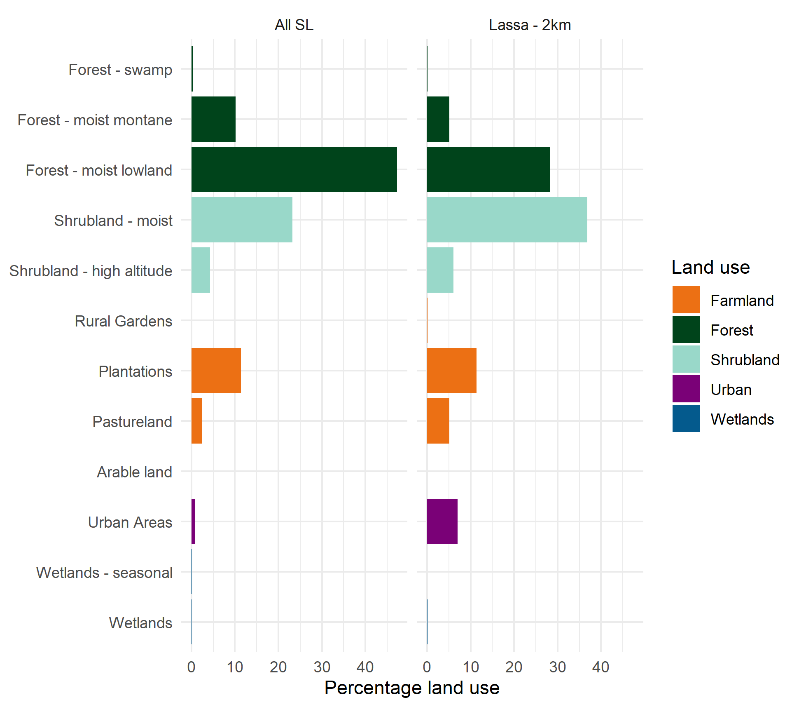
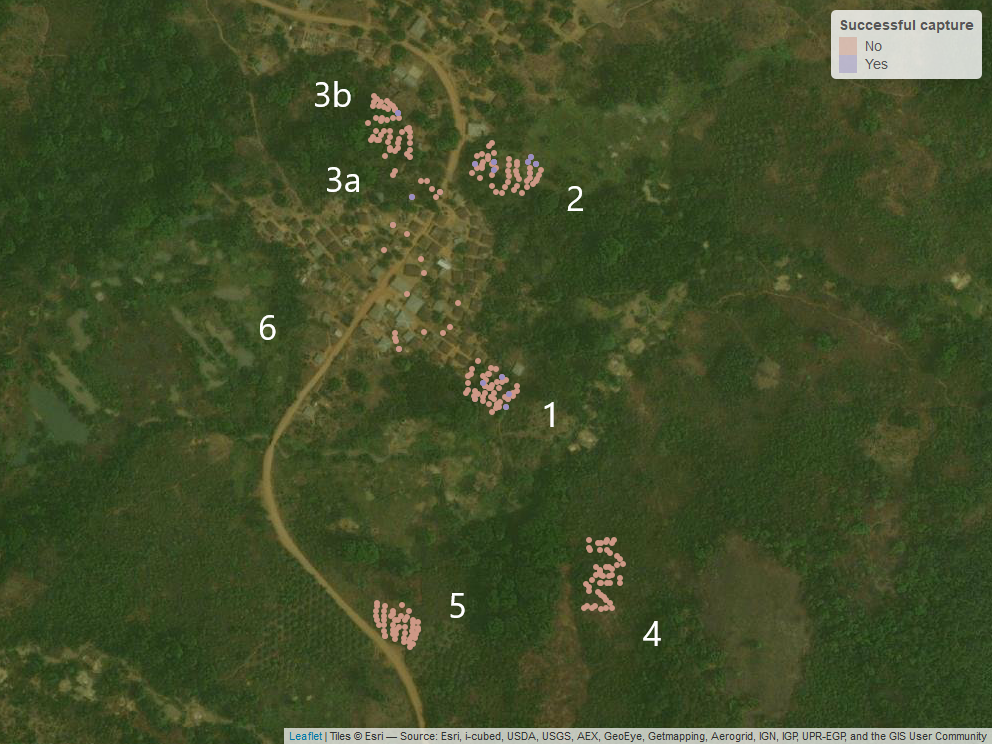
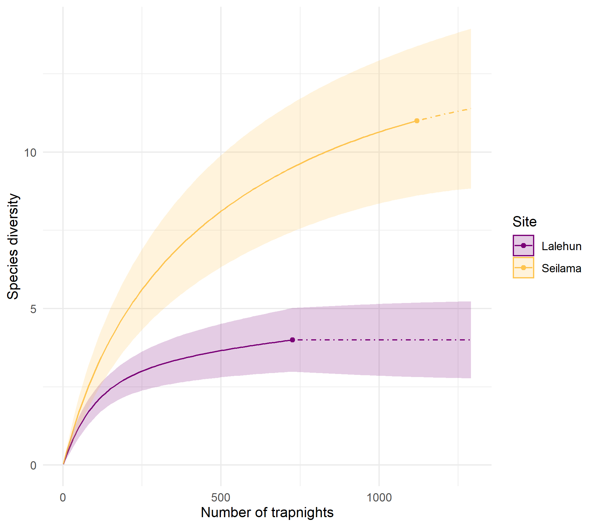

```{r setup, include=FALSE, quietly=TRUE}
knitr::opts_chunk$set(echo = TRUE, warning = F, message = F)
source(here::here("scripts", "0_report_library.R"))
```
This report uses data from the rodent trapping pilot study performed in November-December 2020. All data is available at the GithHub `rodent_trapping` repository [here](https://github.com/DidDrog11/rodent_trapping) and data extracted from other publicly available resources.

## Hypothesis
Increasing intensity of anthropogenic land use along a socio-ecological gradient affects rodent species richness and abundance within a Lassa fever endemic region of Sierra Leone, altering within rodent and rodent-to-human transmission dynamics of Lassa fever virus.

### Study questions
  * Is degree of anthropogenic habitat disturbance associated with a change in rodent assemblages favouring generalist species?
  * Does the structure of rodent species assemblages within a habitat alter Lassa fever virus incidence and prevalence in Mastomys natalensis?
  * Does habitat degradation and subsequent change in rodent species assemblages increase the risk of Lassa fever virus spillover events into local human populations?

### Study site selection
A recent review conducted by [@gibb_understanding_2017] collated published and unpublished documented Lassa Fever cases (humans) and infections (PCR) or seroprevalence (Ab) (rodents) from countries reporting LASV presence. This data has been used to support study site selection following production of Figure \@ref(fig:site-selection) and \@ref(fig:lassa-panguma).

```{r site-selection, quietly=T, echo=F, fig.cap = "Location of Lassa cases and infections in Sierra Leone"}
include_graphics("figures/lassa_SL.png")
```

This highlights that most of the documented cases of Lassa Fever in Sierra Leone are found in the East of the country. There is a particularly large cluster around Kenema, the location of the Lassa Fever treatment ward and reference laboratory. There is a smaller cluster to the North and North East of the city around Panguma and Segbwema. recently cases have been detected near Freetown and Bo suggesting a wider distribution. Several projects over the last couple of years, PREDICTS and LAROCS have been conducting larger transect studies across the country which while not formally reported are suggestive of widespread serological evidence of infection in rodents.

My work will be focussed primarily around Panguma. A control site will be set up in Kambia in Western Sierra Leone in the future. The current pilot study aimed to initialise 2 village study sites in the Panguma region to refine the protocols and data collection methods.

```{r lassa-panguma, quietly=T, echo=F, fig.cap="Location of Lassa cases and infections in Eastern Sierra Leone"}
include_graphics("figures/lassa_panguma.png")
```

The above map displays the locations of human cases and positive rodents in Eastern Sierra Leone. The majority of locations are from Panguma and the surrounding areas. The cases reported in Kenema are likely those diagnosed at the Lassa fever unit at Kenema Hospital rather than cases that originated in the town. This map in combination with land use maps was used to select the two rural sites. Lalehun, the first village site, lies to the East of Panguma. Seilama, the second village site, lies to the South West. Both are represented by a black circle.

### Land use in Sierra Leone

Remote sensing through satellite imagery provides a powerful potential method of clasifying and monitoring land use. A recent paper [@jung_global_2020] used machine learning approaches to categorise global land use based on the International Union for Conservation of Nature and Natural Resources (IUCN) habitats classification scheme ([v3.1](https://www.iucnredlist.org/resources/habitat-classification-scheme)). The associated repository for their work is available [here](https://github.com/Martin-Jung/Habitatmapping). 

Eastern Sierra Leone where the majority of Lasssa fever cases are reported from is more heavily forested and has less intense agricultural production than the Southern or Western regions of the country. The landuse for the Eastern Province is shown in Figure \@ref(fig:raster-sle).

```{r raster-sle, quietly=T, echo=F, fig.cap="Land use types in Eastern Sierra Leone based on satellite classification"}
include_graphics("figures/sle_raster.png")
```

Habitat classification has been produced at ~100m resolution, the proportion of each habitat type in Eastern Sierra Leone can be produced. The most common land types are Forest, Shrubland and Plantations with the urban landscape comprising <3% of habitats.

To investigate habitat types around historic Lassa fever cases a buffer of 2km radius was placed around geolocated cases. Figure \@ref(fig:lassa-landuse) compares this to the proportion of habitat types in Eastern Sierra Leone.

```{r lassa-landuse, quietly=T, echo=F, fig.cap="Land use types in Sierra Leone (Top), Eastern Sierra Leone (Middle) and land use in the buffer area of Lassa fever cases in Eastern Sierra Leone (2km radius) (Bottom)."}

```

The study villages were selected based on their proximity to historic lassa fever cases and suitability of access at different times of the year. The habitat types within 2km radius of the village centers are shown below. The habitat maps and discussions with local residents allowed the study team to identify suitable study sites that would provide us with an adequate sample of different habitats that would remain amenable for trapping during the rainy season.

``` {r village-landuse, layout = "l-page", quietly = T, echo = F, fig.cap = "Land use at 100m resolution in a 2km radius from the centre of each village study site."}
include_graphics("figures/villages_plots.png")
```

### Lalehun (Village 1) trap grid locations

Lalehun is a village of around 1,000 inhabitants along the main road from Panguma to Tongo. Traps were geolocated using Garmin GPSMAP 66 to an accuracy of up to 3 metres. No traps were placed in village homes during the initial pilot visit. The location of each trap was marked with coloured ribbon at eye level to support identification on subsequent days.

```{r lalehun-trap-map, echo=F, layout = "l-page", fig.cap="Satellite map showing the locations of traps set in Lalehun and whether a rodent was succesfully trapped"}

```

``` {r trap_data, include = F}
source(here("scripts", "rodent_data_management.R"))
```

```{r trap_site_classifications_lalehun, include=F}
trap_sites %>%
  filter(village == "Lalehun") %>%
  dplyr::select(grid_number, habitat) %>%
  distinct()
```

The habitats of the trap grids are as follows:

 * 1 - Village periphery
 * 2 - Proximal agriculture (wet rice field)
 * 3a - Developing Banana plantation and fallow land
 * 3b - Developing Banana plantation and Pineapple garden
 * 4 - Disturbed forest, long-term (5 years) fallow land
 * 5 - Cassava plantation
 * 6 - Within the village, outside of houses
 
The specific location of each individual trap was also recorded (e.g. edge environment, base of tree). 

### Seilama (Village 2) trap grid locations

Seilama is a small village of around 200 inhabitants to the South-West of Panguma. 

```{r seilama-trap-map, layout = "l-page", echo=F, fig.cap="Satellite map showing the locations of traps set in Seilama and whether a rodent was succesfully trapped"}
include_graphics("figures/seilama_traps_edit.png")
```

```{r trap_site_classifications_seilama, include=F}
trap_sites %>%
  filter(village == "Seilama") %>%
  dplyr::select(grid_number, habitat) %>%
  distinct()
```
The habitats of the trap grids are as follows:

 * 1 - Palm plantation, near the village and main road
 * 2 - Proximal agriculture (Cacao and Coffee plantation)
 * 3 - Recently harvested dry rice field
 * 4 - Wet rice field
 * 5 - Disturbed forest, long term fallow
 * 6 - Within the village, outside of houses

This produces 1 trap site in the village, 3 proximal agricultural sites, 1 distal agriculture and 1 forest/fallow land site for each village site.

## Initial data

### Trap data

Lalehun was visited first, fewer trapnights were obtained from Lalehun (n = 726) than from Seilama (n = 1120).

```{r trap-nights, echo=F}
trap_palette <- c("#7a0177","#fee391", "#fec44f",  "#00441b")
names(trap_palette) <- c("Village", "Distal agriculture", "Proximal agriculture", "Forest/fallow land")

ggplot(trap_sites) +
  geom_bar(aes(x = village, fill = habitat), position = "fill") +
  scale_y_continuous(labels = scales::percent) +
  theme_minimal() +
  scale_x_discrete(labels = c("Lalehun N = 726", "Seilama N = 1120")) +
  scale_fill_manual(values = trap_palette) +
  labs(title = "Proportion of trap-nights obtained from each habitat",
       fill = "Habitat",
       x = "Village",
       y = "Percentage")
```
### Catch data

We recorded the presence or absence of rodent bait the next morning and whether the trap was found to be sprung closed (i.e. it had been disturbed overnight or it had been triggered by an animal or rodent but it had not successfully trapped it). This gives some evidence of activity by rodents or other animals in the trapping areas. 

There appears to be a decrease in removal of bait from the traps in subsequent nights, however, this may be an artifact of changing recording as the days continued.

``` {r bait-removed, echo=F, fig.cap= "The proportion of traps that were found to be missing bait by habitat type"}

trap_sites %>%
  mutate(bait_present = recode(bait_present, "y, partially" = "y")) %>%
  filter(bait_present != "na") %>%
  group_by(trap_night, village, habitat, bait_present) %>%
  summarise(n = n()) %>%
  ggplot() +
  geom_col(aes(x = trap_night, y = n, fill = bait_present), position = "fill") +
  scale_y_continuous(labels = scales::percent) +
  facet_wrap(habitat ~ .) +
  theme_minimal() +
  scale_fill_manual(labels = c("Bait absent", "Bait present"),
                      values = c("#7a0177", "#00441b")) +
  labs(fill = "Bait",
       x = "Trap night",
       y = "Percentage")
```

65 Rodents were trapped during the pilot study:

  * 22 in Lalehun for an overall trap success rate of 3% 
  * 43 from Seilama for a trap success rate of 3.8%

No rodents were trapped in the distal agriculture or forested habitats at Lalehun, although it should be noted that only two nights of traps were set in those locations. 

``` {r trap-success, echo=F, fig.cap = "The proportion of traps found to contain rodents by habitat type and village. Note the variable number of trap nights by village"}

village_palette <- c("#7a0177", "#fec44f")
names(village_palette) <-  c("Lalehun", "Seilama")

trap_sites %>%
  filter(rodent_trapped != "na") %>%
  group_by(trap_night, village, habitat, rodent_trapped) %>%
  summarise(n = n()) %>%
  mutate(proportion = n/sum(n)) %>%
  ggplot() +
  geom_col(aes(x = trap_night, y = proportion, fill = village, alpha = rodent_trapped), position = "dodge") +
  facet_wrap(habitat ~ ., scales = "free") +
  theme_minimal() +
  scale_fill_manual(values = village_palette) +
  scale_alpha_discrete(labels = c("Trap empty", "Rodent trapped"),
                     range = c(0.2,1)) +
  labs(fill = "Village",
       alpha = "Trap status",
       x = "Trap night",
       y = "Proportion")
```

#### Location of trapped rodents

48 (74%) of the trapped species belong to the family Muridae, the remaining 17 (26%) were shrews (genus *Crocidura*). 

The shrews (genera *Crocidura*) form the highest proportion of individuals. *Praomys* and *Lophuromys* were the most abundant Muridae genera. *Praomys* was not detected in Lalehun with *Lophuromys* being detected at both study sites. *Mus* and *Lemniscomys* were the only other Muridae caught in Lalehun. 6 additional genera of Muridae were trapped in Seilama compared with those caught in Lalehun.


``` {r rodent-trap-plots, echo=F, fig.cap = "The number of individuals caught in each village identified to Genus"}
murid <- OpenImageR::readImage(here("reports", "figures", "murid_png.png"))

trapped_rodents %>%
  mutate(village = substr(rodent_id, 1, 3),
         village = as_factor(recode(village,
                                    "SEI" = "Seilama",
                                    "LAL" = "Lalehun"))) %>%
  group_by(genus, village) %>%
  summarise(n = n()) %>%
  mutate(total = sum(n)) %>%
  mutate(genus = as_factor(snakecase::to_sentence_case(as.character(genus)))) %>%
  ggplot() +
  geom_col(aes(x = reorder(genus, total), y = n, fill = village)) +
  coord_flip() +
  theme_minimal() +
  scale_fill_manual(values = village_palette) +
  labs(y = "Number",
       x = "Genus",
       fill = "Village",
       caption = "") +
  annotation_custom(rasterGrob(murid), ymin = 12.5, ymax = 17.5, xmin = 0, xmax = 5)
```

The habitats that each individual was trapped from are shown in the following figures. Due to the small numbers trapped during this pilot no inference should be drawn from their distribution.

``` {r rodent-trap-plot-2, echo=F, fig.cap = "The habitat fo trapped rodents, both villages are combined"}
trapped_rodents %>%
  filter(family == "muridae") %>%
  dplyr::select(rodent_id, genus) %>%
  left_join(., trap_sites %>%
              dplyr::select(rodent_id, habitat, village),
            by = "rodent_id") %>%
  mutate(genus = as_factor(snakecase::to_sentence_case(as.character(genus)))) %>%
  group_by(genus, habitat, village) %>%
  summarise(n = n()) %>%
  group_by(genus) %>%
  mutate(trapped = sum(n)) %>%
  arrange(-trapped) %>%
  ggplot() +
  geom_waffle(aes(fill = habitat, values = n, alpha = village), color = "white", make_proportional = F, n_rows = 2, show.legend = T) +
  facet_wrap(~ genus) +
  scale_fill_manual(values = trap_palette) +
  theme_minimal() +
  theme_enhance_waffle() +
  labs(fill = "Habitat",
       caption = "1 box per trapped individual")
```

Shrews were trapped in most locations but not from the forested/fallow areas.

``` {r location-shrews, echo=F, fig.cap = "Habitats of trapped shrews. The distribution is shown for each village"}
shrew <- OpenImageR::readImage(here("reports", "figures", "shrew_png.png"))

trapped_rodents %>%
  left_join(., trap_sites %>%
              dplyr::select(rodent_id, habitat, village),
            by = "rodent_id") %>%
  filter(family == "soricidae") %>%
  mutate(genus = as_factor(snakecase::to_sentence_case(as.character(genus)))) %>%
  ggplot() +
  geom_bar(aes(x = village, fill = habitat)) +
  annotation_custom(rasterGrob(shrew), xmin = 2, ymin = 9) +
  coord_flip() +
  scale_fill_manual(values = trap_palette) +
  facet_wrap(genus ~ .) +
  theme_minimal() +
  labs(x = "Village",
       y = "Number of individuals",
       fill = "Habitat")
```

### Diversity

To assess diversity the individuals would ideally be identified to species level rather than Genus as presented througout this report. It is likely all the rodents (n.b. not the shrews) represent individuals from a single species, however, West Africa is home to several cryptic species. Because of this we are not report species level identification until the planned molecular speciation is performed. 

Richness was similar across all sites in Seilama. The low richness reported from Lalehun is likely related to the fewer number of trap-nights.

``` {r rodent-richness, echo=F, fig.cap = "Richness (Genus) at each trap site in Lalehun and Seilama"}
site_labels <-  c("Site 1", "Site 2", "Site 3", "Site 4", "Site 5", "Site 6", "Site 1", "Site 2", "Site 3", "Site 4", "Site 5", "Site 6")
names(site_labels) <- c("Lalehun_1", "Lalehun_2", "Lalehun_3", "Lalehun_4", "Lalehun_5", "Lalehun_6",
                        "Seilama_1", "Seilama_2", "Seilama_3", "Seilama_4", "Seilama_5", "Seilama_6")


trapped_rodents %>%
  mutate(village = substr(rodent_id, 1, 3),
         village = recode_factor(village, 
                                 "LAL" = "Lalehun",
                                 "SEI" = "Seilama"),
         site_id = substr(site_id, 1, 1),
         site = paste(village, site_id, sep = "_"),
         site = recode(site, !!!site_labels)) %>%
  group_by(village, site, genus) %>%
  summarise(n = n()) %>%
  summarise(richness = n()) %>%
  ggplot() +
  geom_col(aes(x = site, y = richness)) +
  facet_grid(. ~ village, scales = "free_x") +
  scale_x_discrete(labels = site_labels) +
  theme_minimal() +
  labs(y = "Genus richness",
       x = "Trap site")
```

Relative abundance was potentially incrased in the agricultural and fallow sites in Seilama compared to the village site.

``` {r individual-abundance, echo=F, fig.cap = "Number of individuals trapped in each habitat in Lalehun and Seilama"}
trapped_rodents %>%
  left_join(., trap_sites %>%
              dplyr::select(rodent_id, habitat, village),
            by = "rodent_id") %>%
  mutate(village = substr(rodent_id, 1, 3),
         village = recode_factor(village, 
                                 "LAL" = "Lalehun",
                                 "SEI" = "Seilama"),
         site_id = substr(site_id, 1, 1),
         site = paste(village, site_id, sep = "_")) %>%
  group_by(site, habitat) %>%
  summarise(abundance = n()) %>%
  mutate(village = factor(substr(site, 1, 7))) %>%
  ggplot() +
  geom_col(aes(x = site, y = abundance, fill = habitat)) +
  scale_x_discrete(labels = site_labels) +
  scale_y_continuous(breaks = scales::pretty_breaks()) +
  scale_fill_manual(values  = trap_palette) +
  facet_grid(. ~ village, scales = "free_x") +
  theme_minimal() +
  labs(y = "Individuals trapped",
       x = "Trap site",
       fill = "Habitat")
```

A species accumulation curve was generated to understand the likely trapping effort required at both study site to adequately characterise the rodent assemblages. This should be performed on distinct species rather than, as here, genus. However, while we have not identified these rodents to species level currently, based on their taxonomy and morphometrics it is likely that each murid genera represents a single species from that genus. This is unlikely to hold true for the *Crocidura*.

The species accumulation curve for Lalehun reaches an asymptote during before the end of the trapping period suggesting high likelihood of adequate sampling. The curve for Seilama continues to rise beyond the end of the trapping period suggesting unsampled species remain at the study site.

``` {r species-accumulation, echo=F, fig.cap = "Species accumulation curves for Lalehun and Seilama"}

```


### Species ID

A taxanomic key for the small mammals likely to be trapped at the sites based on occurrence data was produced from two sources. The first by [Ara Monadjem et al.](https://www.degruyter.com/view/title/126014) which had data on rodents and the second by [Kingdon and Happold](https://www.bloomsbury.com/uk/mammals-of-africa-9781408122570/). These resources provided data that has been extracted into `rodent_ids.R`. The local team also had expertise in identifying rodents to species which was invaluable.

The `field_id` is based on their initial classification. I have then compared the measurements obtained in the field with the published measurements to corroborate their classification or suggest potential misclassification. All rodents were photographed and tissue samples were taken for chromosomal ID if required.

The below table captures the mean and range of the metrics we have recorded in the field. Some species are missing catalogue data. This produces the reference species list.

``` {r, rodent_id, echo=F, layout="l-body-outset"}
rodent_ids <- readxl::read_xlsx(path = here("data", "trap_sites_all.xlsx"), sheet = 4)
rmarkdown::paged_table(rodent_ids)
```

This data is matched to the measurements in the literature in `scripts/matching_species.R`. It is split into Rodents and Shrews as they can be distinguished at that level. In future versions I will do similar for the genera of the rodents for those that are able to be taxanomically distinguished based on external appearance.

This generates two dataframes (one for rodents and one for shrews) where for each individual I rank the similarity to the literature measurements. I allow them to match to the mean +/- 10%, there is no allowance for being above or below the min/max. A weighted score is then generated from the proportion of means that were matched between the individual and reference species across the morphometric measurements (termed the `mean_match`). The same is done for ranges (termed the `range_match`). A weighted score is then produced where the range match is worth half of the mean match. These weighted scores are then ranked for each individual to give a similarity index for each individual against all the reference species. At the moment these can be viewed in the below tables. I will use this to revisit some of the classifications. For example it seems the species that have been labelled *Mus minutoides* more closely resemble *Mus setulosus*

```{r rodent_matching, echo=F, layout="l-body-outset"}
rodent_matches <- read_rds(here("data", "speciation", "rodent_matches.rds"))
names(rodent_matches) <- snakecase::to_sentence_case(names(rodent_matches))
rmarkdown::paged_table(rodent_matches %<>%
  rename("Rodent ID" = "Rodent id",
         "Initial Species ID" = "Initial species id") %>%
  mutate(`Initial Species ID` = snakecase::to_sentence_case(`Initial Species ID`)))
```

And for Shrews

```{r shrew_matching, echo=F, layout="l-body-outset"}
shrew_matches <- read_rds(here("data", "speciation", "shrew_matches.rds"))
names(shrew_matches) <- snakecase::to_sentence_case(names(shrew_matches))
rmarkdown::paged_table(shrew_matches %<>%
  rename("Rodent ID" = "Rodent id",
         "Initial Species ID" = "Initial species id") %>%
  mutate(`Initial Species ID` = snakecase::to_sentence_case(`Initial Species ID`)))
```
