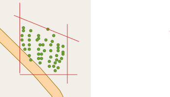

```{r setup, include=FALSE, echo=F}
knitr::opts_chunk$set(echo = TRUE)
library("tidyverse")
library("here")
library("sf")
library("tmap")
```

## Preparation for field work

Before going to the field it's important the following are checked

  1. Adequate number of clean and functioning Sherman traps are brought. You will need at least **324** to set up the correct number so please bring some extra.
  2. Enough sample pots for rodent specimens
  3. Spare batteries for GPS devices
  4. Battery packs if possible for the electronic tablets
  5. Working portable freezer that can be stored at Panguma Hospital Lab
  6. Paper copies of the data entry form in case the pads stop working


## Finding the trap sites

Using the GPS device (GPS MAP65) to find the study sites.

The coordinates of the corners of the study grids are below. To find them you can use the GPS.

First turn on the device and press the find button on the front above mark. Use the direction buttons to select Coordinates and press enter. This takes to a page that asks you to enter the location. The left and right arrows at the bottom of the screen move across the numbers you can control what is highlighted using the directional buttons and enter selects. This will then produce a purple line that will guide you to the coordinates. Tie some ribbon to a plant to identify this corner of the grid and then perform the same for the 3 other corners.

### Lalehun

We have set up **six** sites in Lalehun. Each site represents a grid that we set lines of traps in. Each line is 7 traps.



For each of the below grids there are coordinates for the corners of the grid. Try and set up lines of traps within the grids so it would be easier if you find the corners first

  1. **Grid 1**: Edge of the village    
      + Closest to the village = 8 11.801 N and 11 4.767 W
      + Furthest from the village = 8 11.782 N and 11 4.742 W
      + 8 11.781 N and 11 4.775 W
      + 9 11.769 N and 11 4.758 W
  2. **Grid 2**: Within and near a wet rice field   
      + Closest to the village = 8 11.921 N and 11 4.771 W
      + 8 11.94 N and 11 4.758 W
      + Furthest in the field = 8 11.923 N and 11 4.727 W
      + 8 11.908 and 11 4.739 W
  3. **Grid 3**: Split into two, one part on the banana field and fallow land, the other on the banana field and pineapple garden   
      + Near the compound = 8 11.9417 N and 11 4.811 W
      + In the fallow land = 8 11.92 N and 11 4.822 W
      + By the water store = 8 11.967 N and 11 4.826 W
      + In the fallow land = 8 11.953 N and 11 4.838 W
  4. **Grid 4**: Long term fallow land    
      + Closest to the road = 8 11.644 N and 11 4.699 W
      + Across the hill = 8 11.687 N and 11 4.696 W
      + Up the hill = 8 11.644 N and 11 4.681 W
      + Up the hill furthest from the road = 8 11.687 N and 11 4.68 W
  5. **Grid 5**: Cassava plantation   
      + Close to the road = 8 11.619 N and 11 4.811 W
      + Down the hill along the road = 8 11.633 N and 11 4.831 W
      + Into the field = 8 11.647 N and W 11 4.832 W
      + 8 11.635 N and 11 4.806 W
  6. In 3 lines through the village   
      + Line 1 beginning = 8 11.911 N and 11 4.797 W
      + Line 1 end = 8 11.819 N and 11 4.79 W
      + Line 2 beginning = 8 11.888 N and 11 4.822 W
      + Line 2 end = 8 11.82 N and 11 4.802 W
      + Line 3 beginning = 8 11.872 N and 11 4.828 W
      + Line 3 end = 8 11.809 N and 11 4.818 W
  

We will add another "site" which will be traps within the houses. For the traps in the houses it is important to note what the room is used for, the type of material the house is made from and the type of roof.

This is the map of the sites so far.

``` {r lalehun_traps, echo = F, layout = "markup"}
lalehun_traps <- read_rds(here("data", "lalehun_traps.rds")) %>%
  st_as_sf() %>%
  distinct(geometry, .keep_all = T) %>%
  mutate(grid_number = recode(grid_number,
                              "3a" = "3",
                              "3b" = "3"),
         lon_DdM = paste(lon_DdM, "W"),
         lat_DdM = paste(lat_DdM, "N"))

tmap_mode("view")
tm_shape(lalehun_traps) +
  tm_dots(col = "grid_number",
          palette = "Dark2",
          popup.vars = c("lat_DdM", "lon_DdM")) +
  tm_basemap("OpenStreetMap")
```

### Seilama

We have set up **six** sites in Seilama.

 1. **Grid 1**: Palm plantation, near the village and main road
    + Close to the main road = 8 7.325 N and 11 11.539 W
    + Down the road away from the village = 8 7.375 N and 11 11.511 W
    + 8 7.375 N and 11 11.535
    + Set this corner yourself
 2. **Grid 2**: Cacao and Coffee plantation
    + Close to the village = 8 7.378 N and 11 11.649 W
    + Along the stream = 8 7.4 N and 11 11.643 W
    + 8 7.413 N and 11 11.653 W
    + Away from the village = 8 7.384 N and 11 11.67 W
 3. **Grid 3**: Recently harvested dry rice field
    + Close to the village = 8 7.424 N and 11 11.657 W
    + Along the ravine = 8 7.446 N and 11 11.66 W
    + 8 7.467 N and 11 11.672 W
    + 8 7.443 N and 11 11.685 W
 4. **Grid 4**: Wet rice plantation
    + Closest to the village = 8 7.234 N and 11 11.651 W
    + Furthest from the village = 8 7.22 N and 11 11.669 W
    + Into the field = 8 7.255 N and 11 11.673 W
    + 8 7.234 N and 11 11.678 W
    + Line outside of grid beginning = 8 7.258 N and 11 11.619 W
    + Line outside of grid end = 8 7.258 N and 11 11.619 W
 5. **Grid 5**: Disturbed forest, long term fallow
    + Closest to the village = 8 7.413 N and 11 11.871 W
    + Away from the village = 8 7.428 N and 11 11.884 W
    + 8 7.441 N and 11 11.861 W
    + 8 7.43 N and 11 11.849 W
 6. Within the village, outside of houses, two lines of 7 within the village
    + Set in a ring around the village
    + Line 1 beginning = 8 7.307 N and 11 11.625 W
    + Line 1 end = 8 7.357 N and 11 11.624 W
    + Line 2 beginning = 8 7.31 N and 11 11.6 W
    + Line 2 end = 8 7.362 N and 11 11.611 W

``` {r seilama_traps, echo = F, layout = "markup"}
seilama_traps <- read_rds(here("data", "seilama_traps.rds")) %>%
  st_as_sf() %>%
  distinct(geometry, .keep_all = T) %>%
  mutate(grid_number = recode(grid_number,
                              "3a" = "3",
                              "3b" = "3"),
         lon_DdM = paste(lon_DdM, "W"),
         lat_DdM = paste(lat_DdM, "N"))

tmap_mode("view")
tm_shape(seilama_traps) +
  tm_dots(col = "grid_number",
          palette = "Dark2",
          popup.vars = c("lat_DdM", "lon_DdM")) +
  tm_basemap("OpenStreetMap")
```